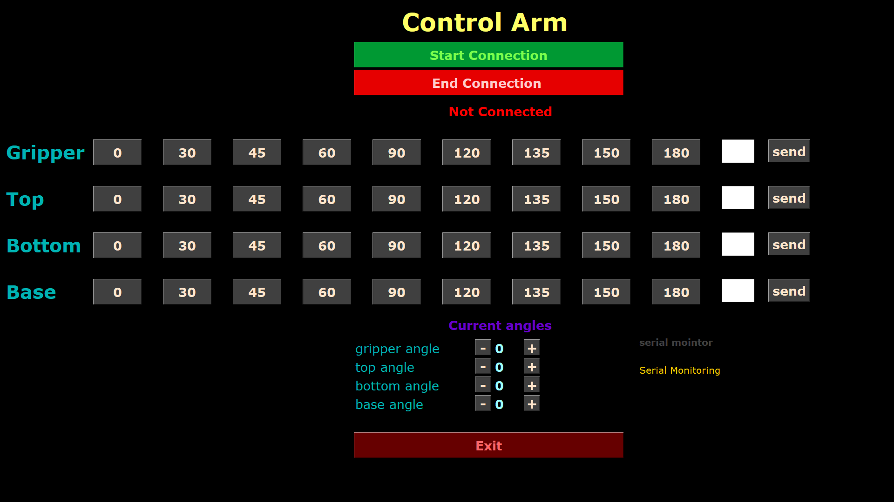
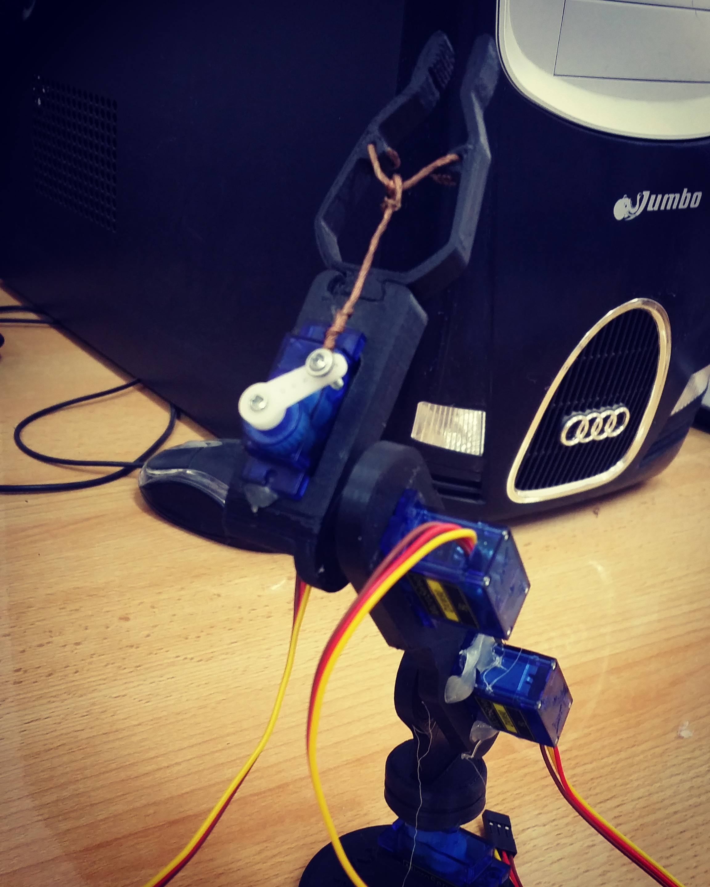

# How To Use ?
Connect your Arduino board to any serial port  , 
once you press  " start connection " python code will get the port name and opens it . 
once connection is established you can send  angles to each motor by pressing the  angle button or type the angle and press " send " the current motors angles will be displayed and you can also increase or decrease them by pressing on "+" and "-"  buttons  .
if data sent successfully it will be displayed . 
# Tools 
 - > Python 3 
 - > Arduino 
# Application GUI 

# The Arm

